# MaterialAgent

**Your Hermes agent, in your pocket.** An Android client for a **Hermes** agent gateway: point it
at your own `hermes serve` and the whole agent loop happens on your phone — streaming replies,
reasoning and tool calls, approvals, mid-turn steering, and the images, audio and files your agent
produces.

| [Sessions](docs/screenshots/sessions-grouping-light.png) | [Streaming reply](docs/screenshots/chat-mid-stream-light.png) | [Approvals](docs/screenshots/chat-approval-light.png) | [Model picker](docs/screenshots/model-picker-light.png) |
| --- | --- | --- | --- |
| 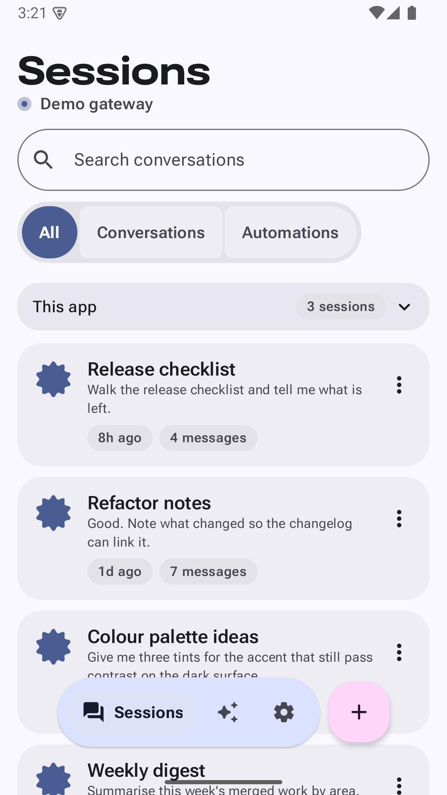 | 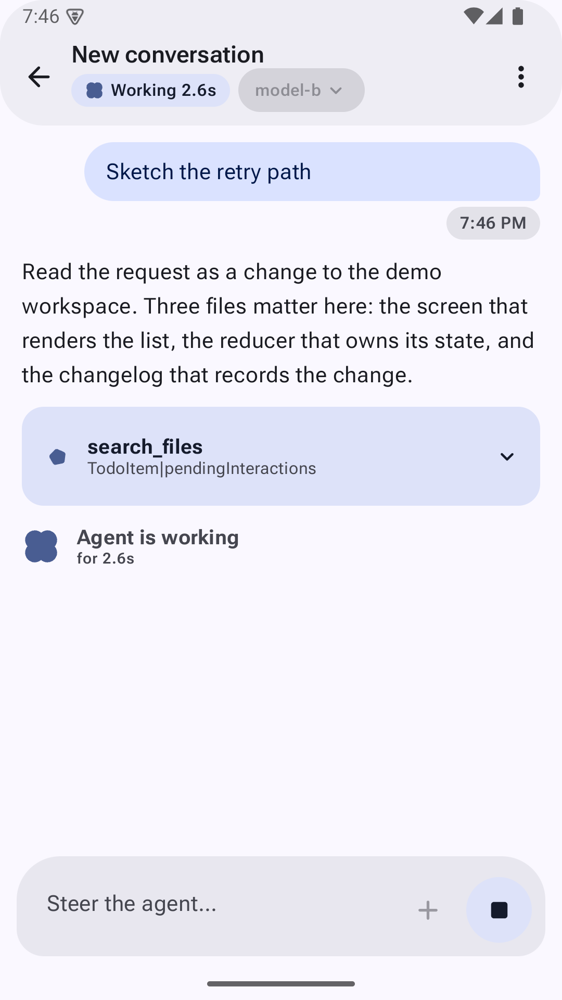 | 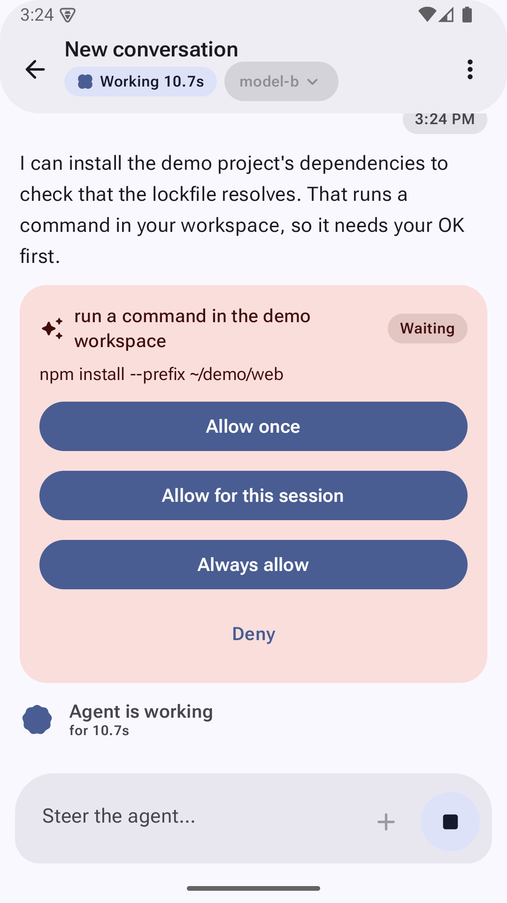 | 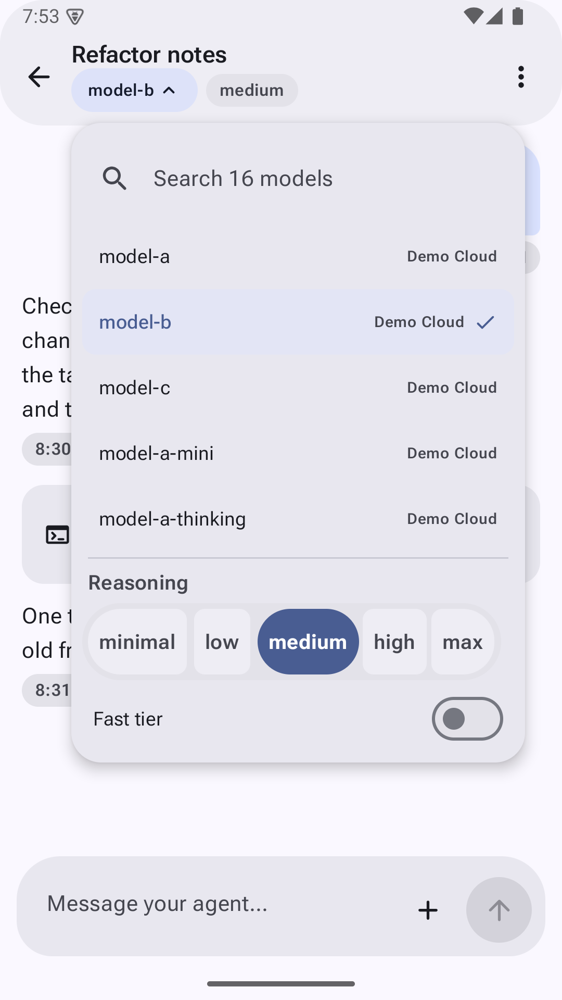 |

## Download

**[Get the latest APK from Releases →](https://github.com/FammasMaz/MaterialAgent/releases)**

1. Download `MaterialAgent-<version>-signed.apk` and open it. Android will ask you to allow
   installing from your browser or file manager the first time.
2. Open MaterialAgent and connect it to your gateway (below).
3. That is the last manual update: the app checks GitHub Releases once a day and installs new
   betas for you in place.

Needs **Android 8.0 or newer** and a Hermes gateway you can reach. Nothing is bundled, relayed or
hosted — the app talks straight to your server.

## What you get

- **Live transcripts.** Replies stream in character by character, reasoning stays foldable, tool
  calls show the command they ran and expand to arguments and result, and todos, compaction notes
  and elapsed-work feedback appear where they happen.
- **Say yes or no.** Approvals and clarifying questions arrive as cards you answer in place;
  unanswered approvals are retired when their turn ends.
- **Steer, don't wait.** Type while the agent is working and your message steers the turn — or
  stop it outright.
- **Media both ways.** Images it draws, audio it speaks (scrub and save like any player), files it
  writes; and you can send photos, audio, documents and voice notes back.
- **Your server's whole catalogue.** Search-first model picker over every model the gateway
  advertises, with reasoning effort; per-connection toolsets, skills and MCP servers; live
  context-window and throughput usage.
- **Scheduled work that stays tidy.** Every cron run of the same job folds under one header
  instead of flooding your session list.
- **Made to look right.** Material 3 Expressive throughout, Material You dynamic colour, light and
  dark, spring motion, plus semantic haptics and settings for both — including a reduced-motion
  mode.
- **Background notifications** when a turn finishes, or needs an approval, while you are elsewhere.

## Connect to your gateway

You need a reachable Hermes server (`hermes serve`). In the app, fill in the connect screen:

| Field | What to put there |
| --- | --- |
| **Address** | Your gateway, host and port — e.g. `192.168.1.27:9119`, or `http://myserver:9119`. A path is fine; the app appends `/api/ws`. |
| **Auth method** | `Access token` for loopback/dev tokens, `Password` for the dashboard login. |
| **Username / password** | Only with `Password`: the dashboard username and password. The password is used to sign in and never travels on the socket. |
| **Nickname** | Optional label for the saved connection. |

Saved connections are listed on the connect screen; tap one to reconnect.

Notes worth knowing:

- **Your phone has to be able to reach the server.** Over Tailscale, `serve` is tailnet-only (not
  Funnel), so sign the phone into the same tailnet — and connect with the hostname that
  `dashboard.public_url` names rather than a raw tailnet IP, since the dashboard only accepts
  loopback and that exact host.
- **Authentication is not optional on a reachable server.** Setting `dashboard.public_url`
  activates it even on loopback, and Hermes will not start without a registered provider. There is
  no unauthenticated public mode.
- While a connection is being made the form is disabled — that is the app working, not frozen.

## Troubleshooting

| What you see | What it means |
| --- | --- |
| "Connection failed" with a banner | Tap **Retry**; check the address, the network, and that you are signed into the tailnet. The banner text names the failing step. |
| `Invalid Host header` from the server | You used an address the dashboard does not accept. Use the hostname in `dashboard.public_url`, or a loopback address through a tunnel. |
| `401` on sign-in | Wrong username or password (or the server has no password provider). |
| `403` using an access token | The server has authentication on and no dev-token access; switch to `Password`. |
| The APK will not install over an existing one | Updates must be signed with the same certificate. Uninstall the older build first — or update from inside the app instead. |
| No notifications about finished turns | Grant the notification permission, then check **Settings → Notifications** in the app. |
| Screenshots come out black | The app blocks them by default, so a transcript cannot leak into the screenshots folder or the Recents view. Turn on **Settings → Allow screenshots**. |
| A session that is missing from the list | A session is only persisted once its first turn completes; the server also cannot delete an active one. |

## Screenshots

| | | |
| --- | --- | --- |
|  | 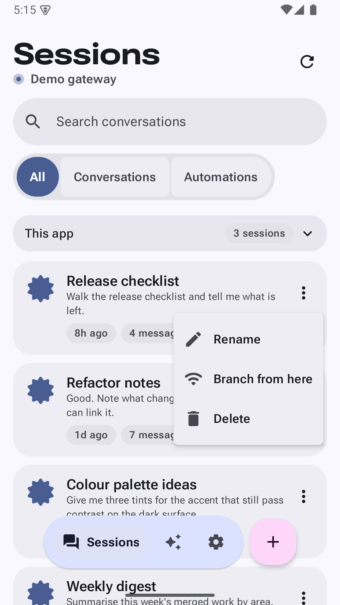 | 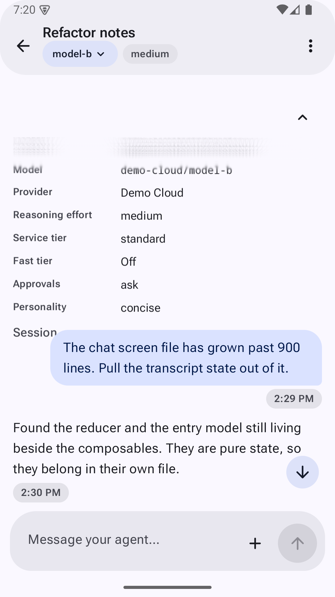 |
|  | 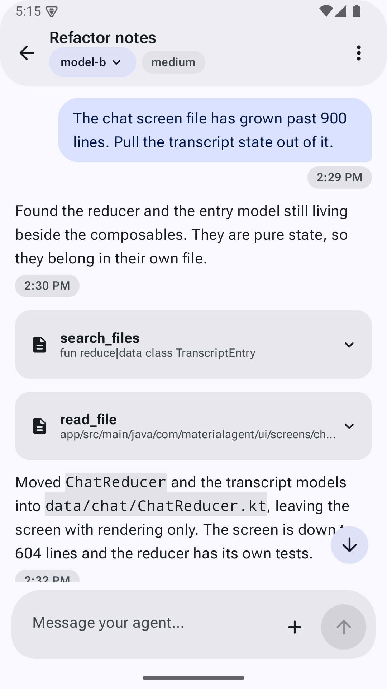 | 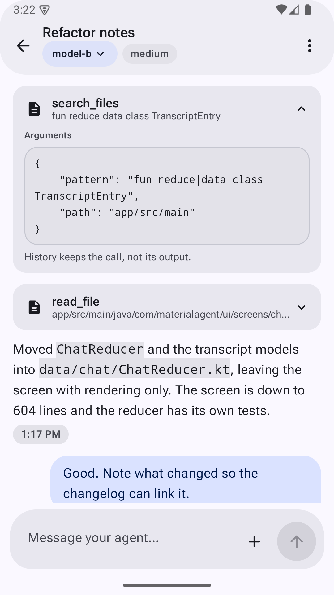 |
|  | 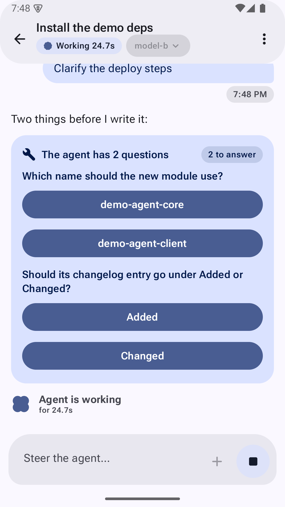 | 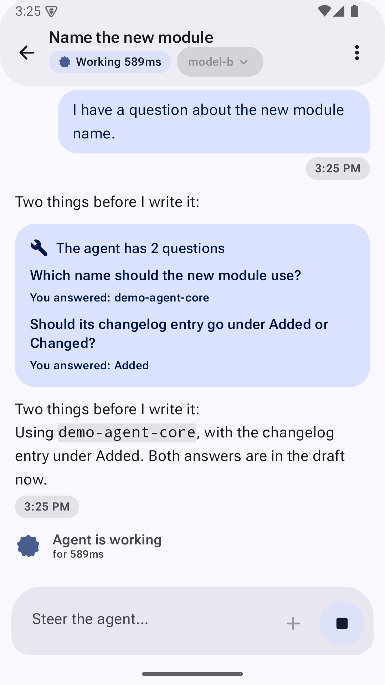 |
|  | 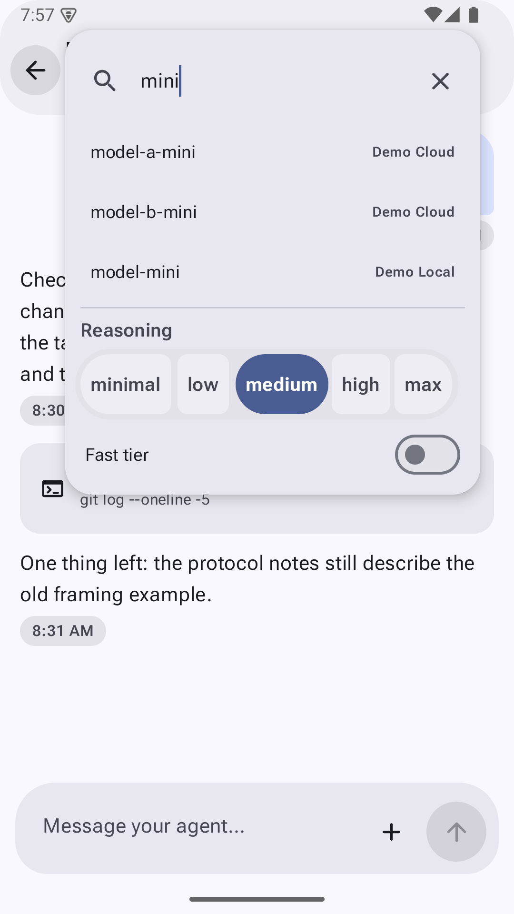 | 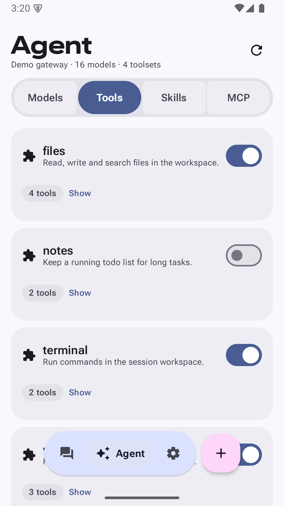 |
| 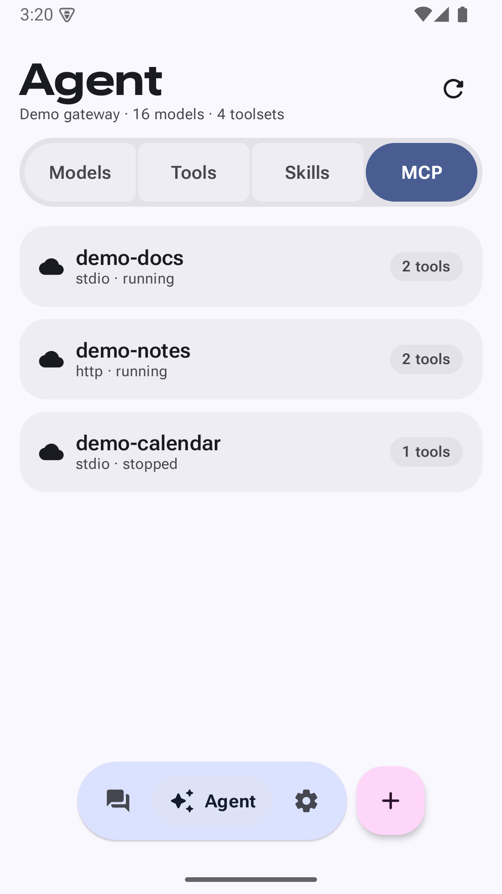 | 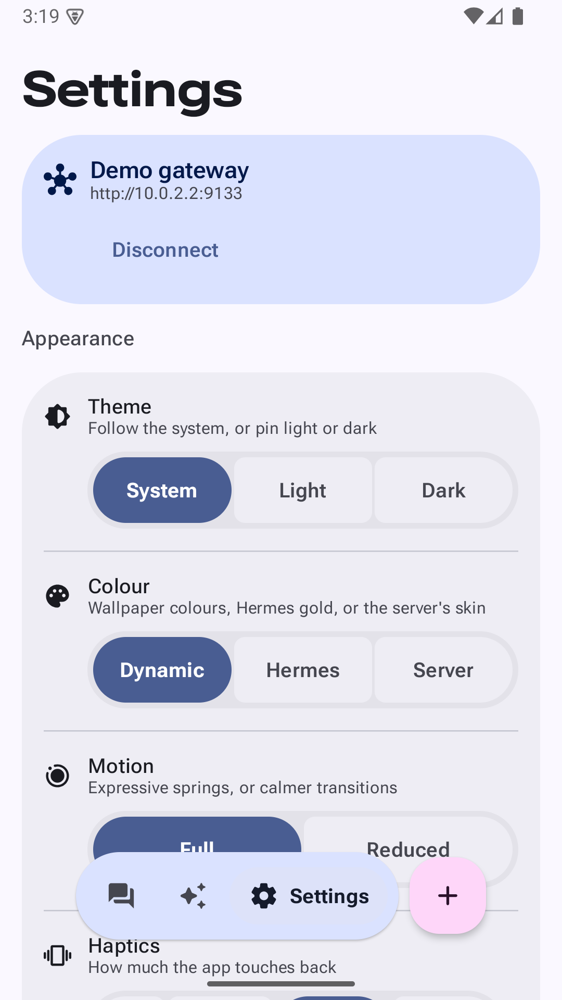 | 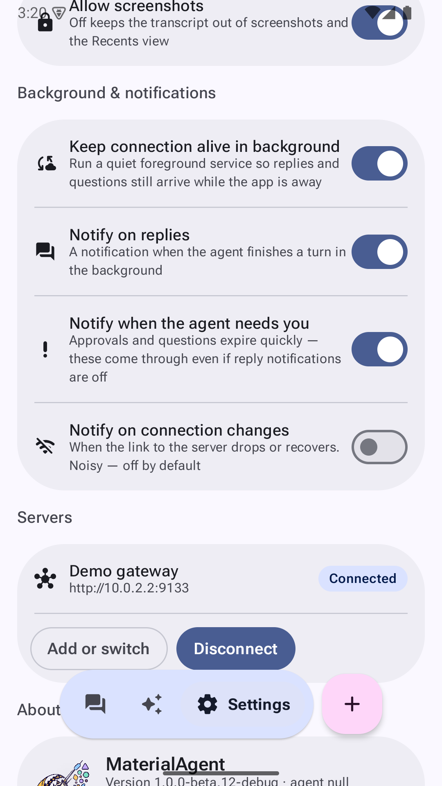 |
| 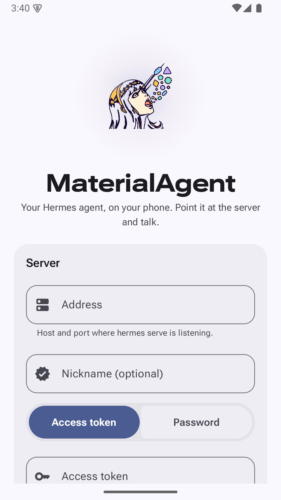 | 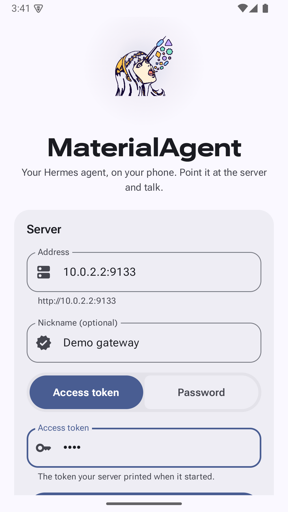 | 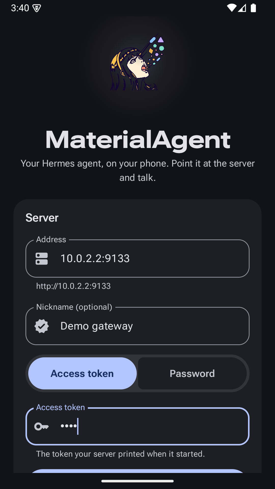 |
| 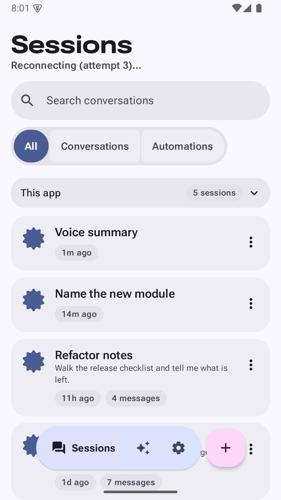 | 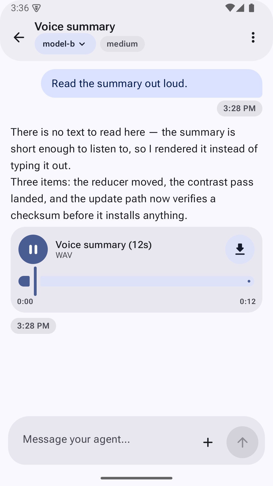 | 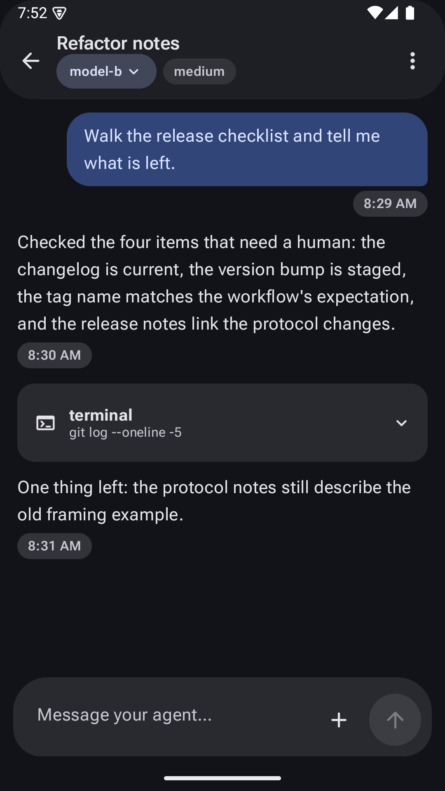 |

Every screen here was captured against `scripts/demo-gateway.py`, the fake gateway in this
repository — there is no real server, account or conversation in any of these images.

## Not there yet

- Sudo and credential prompts are implemented but only unit-tested against the gateway's payload
  shapes — they have not been driven live.
- A clarify question that offers choices can only be answered from those choices; the card does
  not offer a free-text field for it.
- This is a beta (`1.0.0-beta.N`), and the gateway protocol has moved under the client more than
  once.

## For developers

Build, tests, architecture, release machinery, design-system notes and the protocol traps that
shaped the client all live in [`docs/DEVELOPING.md`](docs/DEVELOPING.md). The gateway protocol
itself, as verified against a live server, is [`docs/PROTOCOL.md`](docs/PROTOCOL.md).
